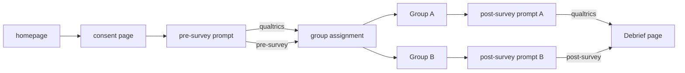

# Koal-AB

<div align="center" style="margin-bottom: 20px;">
  
</div>

<div align="center">
  
  <a href="https://colab.research.google.com/drive/1cq88wa9YAMwSbDkBDCzqMuhMvcGvpMEa?usp=sharing">
    
  </a>
  
</div>


--- 
## Table of Contents
- [Introduction](#introduction)
- [Tools & Process](#tools--process)
- [Getting Started](#getting-started)
- [Research Goal](#research-goal)
- [Features](#features)
- [User Journey](#user-journey)
- [License](#license)
- [Acknowledgements](#acknowledgements)
---

## Introduction 

### 🐨

Welcome to the GitHub repository for **Koal-AB** &copy; 2024
 
Are you interested in conducting online research studies with participants? User experience research? Or the ability to A/B test a product, design or idea?

This repo should help you with that!

This code was specifically built for a research project at York University in 2024 titled "*Animation vs Infographic: Does content delivery matter when explaining statistical concepts?*", however, it can be repurposed for your specific research needs.

<br>

<p align="center">
  <i>Unfortunately, you wouldn't be able to participate unless you are the target<br> population for the research study, but here is the flyer if you are curious:</i>
</p>

<p align="center">
  
</p>

## Tools & Process

### 🐨

List of all the software, tools, libraries, and services I used in order to complete this research project. Here is an overview of how they all intermingle:

![Overview](https://lh3.googleusercontent.com/fife/ALs6j_E66dWrh0fGLtnz1xQewYYYhrW2eBvRacSzAw421f5Pl1WKSSBud6vRjjTUc6kWzZvInrH95JwoJTZoQcR6AL2wQuIF3wAkw2_qoGPPHzSnzHbPyLMNseYfWgIseQWlBuYamde1LbUqDQnvX5VcfZlaiS_mLO8XYn1v-G4YMOhzZl7Sj_TscQ-8fMhFl40mvghz78lbqGkMKULXu2XXCO4l8CvT1V68NSlTBdZTKQng6rQtVb0fDATL2noysGFIna3tDvFdaC0InEEwIpVpVYrxIaB3dPGatsLtslHdejQjmReR-YlpJ-YfNf0qqUYTPHnk6Vi4SDzRuiooy6OEc5bH94aI3ERBjOWhKXPcmMIwZFc8i8bfI88gBA34YloDq5vTzD9voUf1TSJ3nqK12Uw6HLR9BFFNoFpIlGdHEX1QoHG6Bo9yRJtK2DzKCe6fFiTEe7GQo-hBtDcjhlCIj3wt28mMwVDJnNWoWeXyiOhJo7kFxQkimuEO6C4g1xMmjmGP1XEtNrXQcT2A9IuDwVddk7JH-0dVYzc_qOBQWkBmKLzzi0oqK5sgaOlzmSkr0U6MZWI1gl6G4UNJCm4PpkpC7dEWnroiTZHX7TtJVpLS7cuO1eJAzUmvoOUV-ZKAojAoLwutvm7sR-D08f08mKvLZNrK9d8pt73w3C0594r_lI7yQAe-V1IE0ZX58NeCFqdFOOvTKfW6DjVRdVRcoIJgmK9HOZshAPwk4nLPLL_9vun-0LEEl6vDn7QdQ8mqet6dRAEH73SyrmKPZU1pQoVohUVtHfOyEbUH39QkTO_xIUHeTkqcE8WCTUyTjMjnilxNCjCMp1jf3eyA8vZHdbsXjwLdM__5AFJnr6jy7ZS3zrj7wgoz9TOTwCnIuZk4uSEkMmrJdn3zxd5Y4VVIANf5hXML4N87CjppccolthOWeqQqWxcjvMsixuooB1we9Xa3aPn_IaG-FDN-b_I_4RyfHSKVUlTkUSy5q3-BtP-nLxKgfiE6YRIdLUNFeXVIvbQjjMCc9eFoBB9egOQn7eqUvgbmz38r7IMl7d1wgz-f1S63FtaTf2sEaLR5qaw9hbYC4OLHMwAZr1iS7UiJR89F4vYokbbtV1BmsG3lrRdPHPxXOiKoDYyaJTmg1LPr4Hbl1Q2nuy6O-RgHkxVvm1sSANYp5oEcRLFdwCPB2ykKp4ZqiC-tPS81etvqJ8n6pfVfjHD3VdH5eeL6tuksgC18aHFHfAjB3pYEKTC01LSJeoqG0xRftM2M6RBx4ZOW1JMBnSu6qO8LOjM6X4OO4_6920nXUCSk8t6CaPms4QDFuIYpTwYpoqlkatwbRnwKGi08puWhDfR-NqaBQjRy-8hveTNO9A0QFlSPkfiw16Gz4ajbXNNa1NxbeEFwlbHNVdjxbPfHwE8x8BhL2VSF4MvyL97ii-pwcr-UlWs8S4oM9ZfkArD1xVUtOAi0eYYsNfSpU2UuXZDvcPt19xXbfUM3LIpKH2cKgW66TLlOMatoSAoektw7vVISgS4x7xxyeLZzgsqZQ_PXDqm7mv3OSyAX1jPZGv0awJQTXW1mOgg1kf7qVLwrMMy6TsUv331pAE7qZAurpTufxvS-oOWuB0j8ENZ9cU2oh96uDy0dEuFfwungrUsWCkytG83cTS8YxTQx75dZJqyg7uPyvHGt4_FrkiPlKG7rdSQ8nlalueXonXuYdjzbuqB5NbdCLvA=w1152-h917)

Manim was used to create the educational animations for **Group A** to view. You can find the link to the Google Colab notebook above.

The site is also written to allow you to swap out and integrate with any survey provider (SurveyMonkey, Google Forms, Typeform etc..) or with your own custom built surveys.

## Getting Started

### 🐨

The requirements.txt file is fairly small:

```py
fastapi==0.110.0
uvicorn==0.29.0
Jinja2==3.1.3
filelock==3.0.12
python-multipart==0.0.9
starlette==0.36.3
```

Once you have cloned the repository, navigate to your terminal and run this command:

```shell
uvicorn main:app --reload
```

This will start a server on `http://127.0.0.1:8000` in your browser

## Research Goal

### 🐨

> This research project was supervised by Dr. Herbert; a full-time faculty member in the Psychology Department, Faculty of Health

This research project aims to investigate the effectiveness of using Manim animations in educating participants on core statistical concepts. The study will focus on concepts that are taught in 2000-level statistics courses at York University: 
1. Central tendency
and
2. Variability

The project will involve creating animations using the Manim graphic engine to explain these statistical concepts. Participants will then be asked to complete a pre-survey before being randomly assigned to either an animated or static content group. One group will view dynamic animations created by Manim with a voice-over explaining the concepts, while the other group will view the same type of statistics content via a static source such as an image or infographic.

After viewing the content, participants will take a post-survey to evaluate their understanding of the statistical concepts. The data collected from the surveys will be compared between the animated and static content groups to identify any differences in learning outcomes. This study aims to contribute to the ongoing discussion on the use of animations in educational content and provide insights into their effectiveness as a learning tool.


## Features

### 🐨

The web app was designed with these key features in mind:

 1) AODA and WCAG compliant.
 2) Partial content loading for video files for better playback.
 3) Responsive for mobile, desktop, tablet, and other devices.
 4) Participant ID generation to link users between surveys.
 5) Modular and easy configuration for A/B testing.
 6) Smooth and frictionless privacy and consent page.


## User Journey

### 🐨

- Users navigate to a homepage that introduces the study's goals and asks for user consent.
- Users who wish to participate are randomly assigned to two groups; A or B.
- Users complete eLearning modules
- Users are asked to participate in surveys that were made in Qualtrics.
- Participants are automatically redirected to the last page that debriefs them on the study.

The idea was to ensure that user experience was never sacrificed. The content should be delivered in an easy and streamlined way, to fit within accessibility guidelines and to be responsive so they could interact with it on their preferred device of choice.



## License

[](LICENSE)

This project is licensed under the [Creative Commons Attribution-NonCommercial 4.0 International License](LICENSE).

## Acknowledgements 

I would like to express my gratitude to the following individuals and projects that have contributed to or inspired this work:

- [Monique Herbert](https://health.yorku.ca/health-profiles/?dept=&mid=1459256): Your insights and feedback greatly improved the quality of this project. Couldn't ask for a better mentor. 
- [Mark Adkins](https://github.com/Standard-Deviator): Thank you for your valuable contributions to UX research, teaching, and statistics. I drew inspiration from DataCrunch's vision.
- Mel Gatt: Provided incredible insight and testing to help polish and refine the project.
- Chloe: My beautiful and amazing wife who offered help on a few features. Her support gives me fuel.
